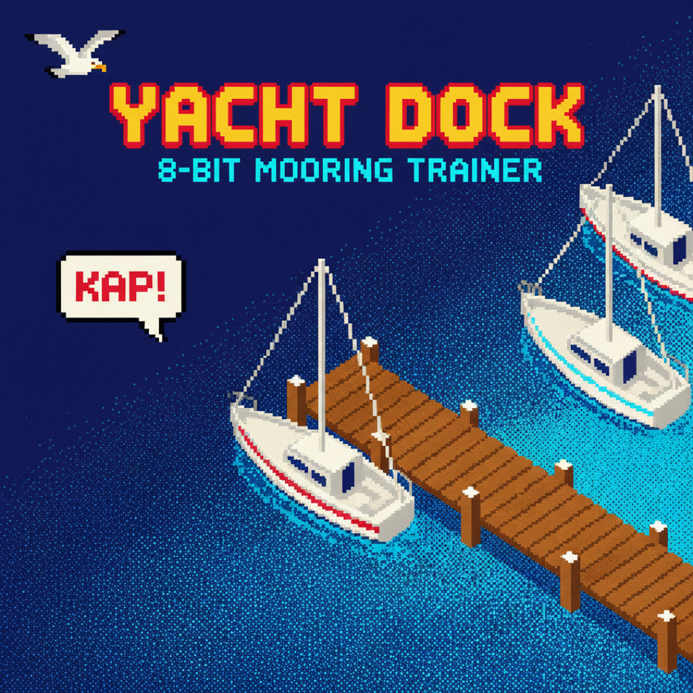

# YACHT DOCK — 8-bit Docking Simulator

[](https://govorunov.pro/yacht-dock/)
[](#license)

Browser-based sandbox sailing simulator. NES/Contra aesthetic, semi-realistic physics, 8-bit OST, mobile first.



**Live:** https://govorunov.pro/yacht-dock/

## What Is It

A docking trainer for building real berthing skills without the fear of scratching a real hull. Choose your boat (30–55 ft, single/twin rudder, keel shape, bow thruster) and dock type (alongside, stern-med, stern-anchor, bow-to, piles, mooring ball), set wind force and direction on the Beaufort scale, adjust neighbour density, and practice.

This is a full rework of the original one-shot generation by [Tim Zinin](https://github.com/TimmyZinin) — same concept and vibe, rebuilt and extended.

## Quick Start

```bash
git clone https://github.com/denisaug/yacht-dock.git
cd yacht-dock
```

Open `index.html` with a double-click — no server needed.

### Development

After changing anything in `src/`, rebuild the bundle:

```bash
npm run build
```

Node.js required (for the build step only). No npm dependencies — `esbuild` is pulled automatically via `npx`.

### Dev Shortcuts

- Append `#config` to the URL — jump straight to the config screen
- Append `#game` to the URL — skip boot and config, start with defaults
- Keyboard: `WASD` / arrows — rudder + throttle, `Q/E` — bow thruster, `M` — mute, `Space` — drop anchor

## Physics

- Semi-realistic: formulas and constants calibrated against real-world figures (see [`docs/PHYSICS.md`](docs/PHYSICS.md))
- Displacement, inertia, and windage all scale with boat length
- Keel shape affects lateral grip and turning radius
- **Prop walk** on a single screw: at reverse, the stern kicks to port
- **Twin rudder** is more efficient at speed but near-useless without forward way — requires a bow thruster for low-speed control
- **Bow thruster** effective only below ~4 kn; cuts off above hull speed
- Wind: `F = 0.5 · ρ_air · Cd · A_eff · V²`, Cd blends 0.7 (bow-on) → 1.1 (beam-on)
- **Gusts:** random 1.25×–2.0× wind spikes, exponential rise (2 s) and slow fade (5 s)

## Controls

- **Mobile:** PORT / STBD / throttle ahead / throttle astern + BOW << >> (NES style)
- **Desktop:** WASD / arrows + Q/E (bow thruster), M (mute), Space (drop anchor)
- **Throttle modes:** click (three detents: slow / neutral / slow) or smooth (fully analogue)

## Stack

- ES modules → bundled by `esbuild` into a single file; opens without a server
- Canvas 2D, procedural pixel art (all sprites drawn in code, no PNG game assets)
- Web Audio API: square / triangle / noise oscillators, 5-track 8-bit OST + SFX
- ~2 300 lines of JavaScript across 9 ES modules

## Architecture

```
yacht-dock/
├── index.html           HTML skeleton (boot / config / game screens + HUD)
├── style.css            NES palette + adaptive layout
├── src/
│   ├── main.js          State machine + fixed-timestep game loop
│   ├── boat.js          Physics: forces, integrator, collision response
│   ├── world.js         Marina generator per dock type, OBB collision detection
│   ├── render.js        Canvas 2D renderer: water, dock, boats, anchor chain, HUD
│   ├── input.js         Touch buttons + keyboard (click-mode and smooth-mode throttle)
│   ├── audio.js         5-track 8-bit OST on VHF channels + SFX
│   ├── seagull.js       Seagull flyby every ~15 s + poop overlay
│   ├── captain.js       CaptainWalker — dock character with nautical phrases
│   ├── tim.js           TimWalker — dock character with AI / startup phrases
│   ├── config.js        Yacht profiles, Beaufort table, keel/rudder factors
│   └── palette.js       NES colour constants
├── assets/              Hero image + screenshots
└── docs/
    ├── HANDOFF.md       ← read this if you're taking over the project
    ├── PHYSICS.md       Formulas, constants, calibration sources
    ├── RESEARCH.md      Survey of existing simulators and NES references
    ├── SPEC.md          Original MVP decisions locked in via HITL
    └── CHANGELOG.md     Version history
```

## Documentation

- [`docs/HANDOFF.md`](docs/HANDOFF.md) — handoff guide: data flow, how to add dock types, danger zone
- [`docs/PHYSICS.md`](docs/PHYSICS.md) — full physics model: all formulas, calibration tables, worked examples
- [`docs/RESEARCH.md`](docs/RESEARCH.md) — research report: simulators, physics sources, NES references
- [`docs/SPEC.md`](docs/SPEC.md) — original MVP spec locked in via HITL
- [`docs/CHANGELOG.md`](docs/CHANGELOG.md) — changelog

## Vibe Features

- 8-bit background music on Web Audio oscillators — 5 tracks, cycle with the SEL button (VHF channel metaphor)
- Every ~15 seconds a seagull flies across the screen with a comic-strip callout
- The seagull poops on the screen 1–2 times mid-flight — white blob drips and fades
- NES Contra aesthetic, thermonuclear palette, dithered animated water

These are not bugs. Captain's attention training.

## Contribution

Forks and PRs welcome. Read `docs/PHYSICS.md` before touching the physics. For adding new dock types see the step-by-step guide in `docs/HANDOFF.md`.

## License

[Mozilla Public License 2.0](LICENSE)

## Credits

- Developed by [Denis Govorunov](https://github.com/denisaug) — full rework in Claude Code, 2026-04-10
- Original one-shot generation by [Tim Zinin](https://github.com/TimmyZinin) in Claude Code, 2026-04-04
- Vibe & coffee support: Tim Zinin ([@timzinin](https://t.me/timzinin))
- Hero image generated via Gemini 2.5 Flash Image
- Research consolidated from the sailing community (Passagemaker, Sailing Britican, Yachting Monthly, etc.) — full list in `docs/RESEARCH.md`
